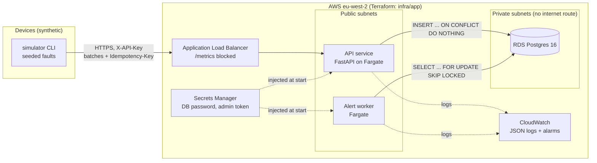

# Architecture

## Components



Locally, `docker compose` runs the same containers against a Postgres container, and
`--profile observability` adds Prometheus and Grafana (dashboard provisioned from
`observability/`).

## Request path: batch ingest

1. The device sends `POST /readings/batch` with its API key and an `Idempotency-Key`.
2. The API hashes the key (SHA-256) and looks up the device.
3. If the idempotency key was seen before, it returns the stored response (or 422 if
   the body differs).
4. It inserts all readings in one statement with `ON CONFLICT (device_id, metric, ts) DO
   NOTHING RETURNING id`. The number of rows returned is the "inserted" count.
5. It stores the idempotency record and commits. The readings and the idempotency record
   are committed together, so a retry can never see one without the other.

## Alert path

The worker claims up to 500 unchecked readings (`FOR UPDATE SKIP LOCKED`), evaluates them
against rules for their metrics, opens or resolves alerts, marks the readings checked and
commits. See [ADR 0002](adr/0002-alert-worker-claims-rows-with-a-flag.md) for why it
doesn't use a cursor.

## Deploy path

```mermaid
sequenceDiagram
    participant Dev as git push main
    participant CI as CI workflow
    participant B as Deploy: build job
    participant R as Reviewer
    participant D as Deploy: deploy job
    participant AWS
    Dev->>CI: lint, types, tests (+Postgres), scans, terraform validate, compose + outage drill
    CI->>B: on success
    B->>AWS: OIDC -> ci-build role; build ARM64 image, Trivy scan, push to ECR (tag = git sha)
    B->>R: "production" environment needs approval
    R->>D: approve
    D->>AWS: OIDC -> ci-deploy role; register task defs, run migration task
    D->>AWS: update worker + api services, wait until stable (circuit breaker rolls back on failure)
    D->>AWS: smoke /livez, /healthz, check /metrics is 404
```

No long-lived AWS keys exist anywhere. GitHub gets short-lived credentials through OIDC,
and each role's trust policy is pinned to this repo (`main` for build, the `production`
environment for deploy).

## Failure behaviour

| Failure | What happens | How it's checked |
|---|---|---|
| Database down | Ingest and queries return **503 + `Retry-After: 5`**, `/healthz` 503, `/livez` 200, so tasks are not restarted. Worker backs off 5 s. | `scripts/db_outage_drill.sh`, run in CI |
| Client retries after a timeout | Same `Idempotency-Key` returns the original result; no double count | unit + Postgres integration tests |
| Duplicate readings | Skipped and counted as duplicates | unit + integration tests |
| Two workers | `SKIP LOCKED` splits the backlog; a partial unique index prevents two open alerts | Postgres integration test |
| Bad deploy | ECS circuit breaker rolls back; migrations run before services update and stop the deploy on failure | `deploy_ecs.sh` |
